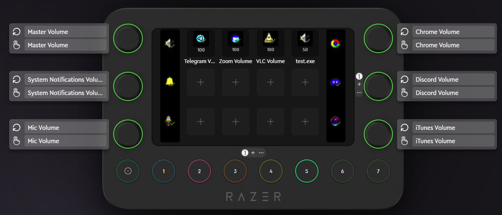
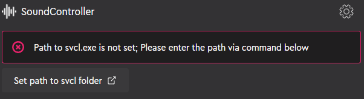
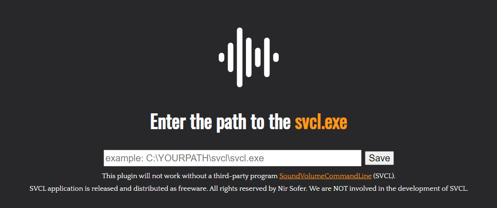
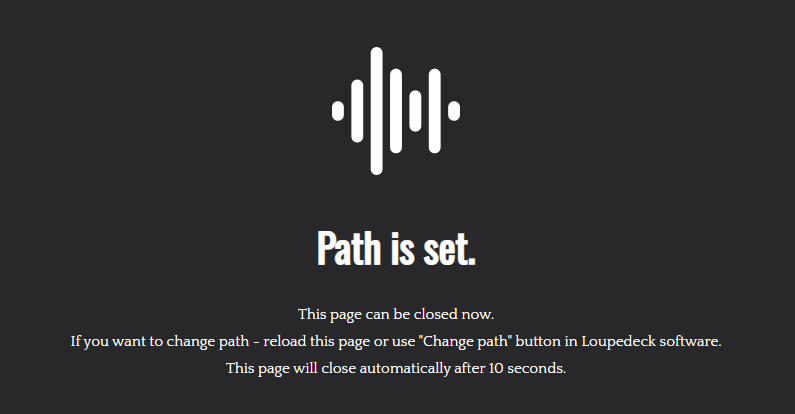

# SoundControllerPlugin for Loupedeck (CT, Live)

This Loupedeck Plugin allows you to control the the volume of **individual applications** in Windows.

## About

This plugin uses the freeware utility [SoundVolumeCommandLine](https://www.nirsoft.net/utils/sound_volume_command_line.html) by launching hidden command line instances. This allows you to control the sound of individual applications or processes in the Windows 8, 10 or 11 operating system.

The plugin is a convenient shell that displays information about the current sound level and allows you to change it.

## Setting up

1. Install plugin via Loupedeck marketplace or [lplug4 file](https://github.com/zer0deck/Loupedeck-SoundController/releases/latest/).
2. [Download and unpack svcl application](https://www.nirsoft.net/utils/sound_volume_command_line.html).
3. Use the button on plugin page or in settings to set up svcl.exe path.

4. You will be redirected on this page:

5. Enter the path and click "save".
6. You will be redirected back in Loupedeck app and window will be automatically closed.

7. Everything works! You're amazing!!!

> ! You can always change svcl.exe path in plugin settings !

## Features

1. This plugin contains several **pre-installed adjustment wheels** to control various applications:

    - Discord
    - Google Chrome
    - iTunes
    - Telegram
    - VLC and etc.

2. Or this plugin allow you to create **your own custom volume wheel**.

## Author

Grandilevskii Aleksei, software engineer,
github: [@zer0deck](https://github.com/zer0deck),
email: zer0deck.work@icloud.com

## Acknowledgement

- Plugin created using [Loupedeck plugin SDK](https://loupedeck.github.io/)
- Special thanks to [Ihor Kotvytskyi](https://github.com/Igor-Kotv/) for understanding the Loupedeck API and using many undocumented functions, which made development much easier for me thanks to his examples.
- The developement of this plugin would not have been possible without [NirSoft](https://www.nirsoft.net/).
